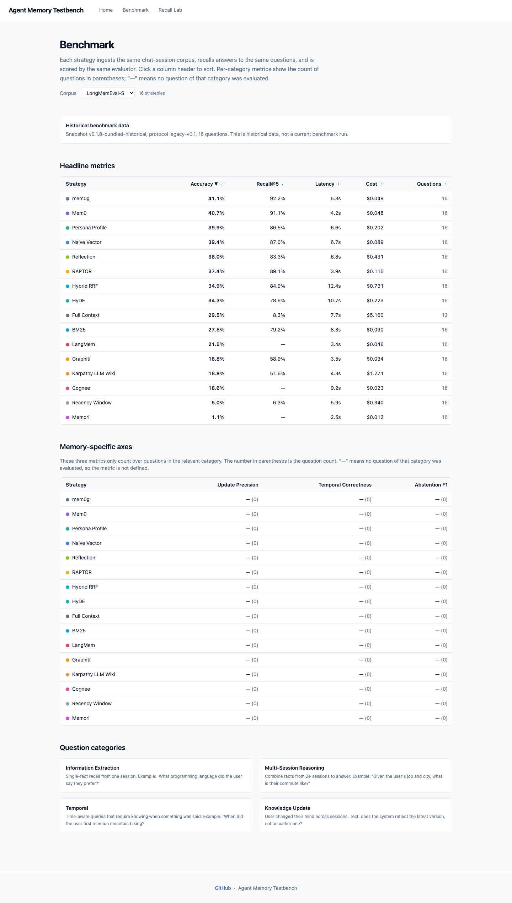

# Agent Memory Testbench

Formerly Memory Arena

**Benchmark agent memory from retrieval to answer.**

Compare memory architectures, trace where answers fail, and rerun versioned evidence from one open testbench.

Planned Pages address: `https://xmpuspus.github.io/agent-memory-testbench/`

No provider keys are needed to inspect the bundled historical evidence:

```bash
pip install memory-arena
memory-arena demo
```

> **Bundled evidence:** `v0.1.8-bundled-historical` has historical status. Its
> manifest lists 16 strategies, 16 questions, and 4 categories assembled from
> mixed source commits and mixed seed counts. It is for inspection, not a
> checked or present ranking.

## Historical bundled evidence: v0.1.8-bundled-historical

The package preserves these records so users can inspect answer, retrieval,
cost, latency, and metadata fields. The snapshot is not controlled enough to
support a current winner, architecture recommendation, or causal conclusion.
Use [`docs/decision-guide.md`](docs/decision-guide.md) to plan a new comparison.

### Limits of the historical snapshot

- **Not "vendor SDK X is bad."** We report vendor-default behavior on a single corpus. A tuned config is a separate measurement; vendor PRs are explicitly invited (see [Vendors: PR your tuned config](#vendors-pr-your-tuned-config)).
- **Not "the systems are comparable today."** N=16 is small, source commits
  and seed counts differ, and v0.2.0 remains planned work.
- **Not "graph memory is dead."** The snapshot has only four
  multi-session-reasoning questions. It cannot support a general conclusion
  about graph memory.
- **Not "every vendor is on the same model."** The result metadata records
  different SDK versions and internal model choices. Treat those differences
  as limits, not controlled variables.
- **Not "the cross-judge report validates the scores."** The legacy
  [`results/cross_judge_report.json`](results/cross_judge_report.json) is invalid
  for claims because it compares incompatible score semantics.
- **Not "the configurations are tuned."** Inspect each result file for its
  recorded defaults and deviations.
- **Not "this generalizes to all memory workloads."** Chat sessions are one slice; tool-use traces, codebases, and long documents are not in scope.
- **Not "row order is a ranking."** The public table follows the manifest
  inventory. It does not claim an ordering of present systems.

### Historical result records

The table follows the 16-strategy `included_strategies` array in
`memory_arena/data/results_snapshot/manifest.json`. It is in manifest order,
not score order. All rows belong to snapshot `v0.1.8-bundled-historical`.

Ten rows combine three seeds and six rows contain one seed. The table shows the
confidence interval stored in each bundled summary when three seeds are
available. Mixed source commits and seed counts prevent a controlled
comparison. The legacy cross-judge report is invalid for claims.

No API keys, Docker, or corpus download are needed to inspect the bundle:

```bash
pip install memory-arena
memory-arena demo
```

The dashboard lives at `http://localhost:8000/`. Home shows 20 registered
implementation cards. Historical Results shows the 16 bundled rows. Recall Lab
supports per-question inspection.

<p align="center">
  
</p>

<p align="center"><sub><i><code>memory-arena demo</code> serves the bundled
historical snapshot with no provider keys. The checked-in image predates the
v0.1.9 trust reset; use the live labels and manifest as authority.</i></sub></p>

<!-- BENCHMARK_TABLE_START -->
| Strategy | Recorded accuracy (95% CI when available) | Recall@5 | Direct API cost | Latency | Status |
| --- | --- | --- | --- | --- | --- |
| `bm25` | 27.5% ±0.3 | 79.2% | $0.090 | 8299ms | ok |
| `cognee` | 18.6% | -§ | $0.023‡ | 9205ms | ok |
| `full_context` | 29.5% | 8.3% | $5.160 | 7664ms | ok |
| `graphiti` | 18.8% | 58.9% | $0.034‡ | 3489ms | ok |
| `hybrid_rrf` | 34.9% ±0.7 | 84.9% | $0.731 | 12360ms | ok |
| `hyde` | 34.2% ±1.5 | 78.5% | $0.223 | 10652ms | ok |
| `karpathy_llm_wiki` | 18.8% | 51.6% | $1.271 | 4263ms | ok |
| `langmem` | 21.5% ±2.5 | -§ | $0.046‡ | 3374ms | ok |
| `mem0` | 40.7% ±4.4 | 91.1% | $0.048‡ | 4241ms | ok |
| `mem0g` | 41.1% | 92.2% | $0.049‡ | 5752ms | ok |
| `memori` | 1.1% | -§ | $0.012‡ | 2472ms | ok |
| `naive_vector` | 39.4% ±3.0 | 87.0% | $0.089 | 6653ms | ok |
| `persona_profile` | 39.9% ±6.1 | 86.5% | $0.202 | 6554ms | ok |
| `raptor` | 37.4% ±0.3 | 89.1% | $0.115 | 3861ms | ok |
| `recency_window` | 5.0% ±0.2 | 6.2% | $0.340 | 5894ms | ok |
| `reflection` | 38.0% ±3.1 | 83.3% | $0.431 | 6838ms | ok |

**Footnotes.** **‡** The harness records direct API cost when calls pass through
its accounting path. Vendor SDK internal costs can be unknown and are not
included here. **§** These strategies do not return chat-session pointers, so
the snapshot does not record comparable Recall@5 values.

_Snapshot inventory: 16 strategies, 16 questions, 4 categories, mixed source
commits, and mixed seed counts. Ten strategies have three-seed confidence
intervals; six have one seed. Row order follows the manifest and is not a
ranking._
<!-- BENCHMARK_TABLE_END -->

#### Dig deeper

| Want… | Read |
|-------|------|
| Inspect four historical answer records | [`docs/case-studies.md`](docs/case-studies.md): four questions with side-by-side answers |
| Plan a controlled comparison | [`docs/decision-guide.md`](docs/decision-guide.md): comparison workflow and use-case matrix |
| What every strategy answered for every question | [`docs/per-question-comparison.md`](docs/per-question-comparison.md): static "ask all 16" page |
| Common objections + answers | [`docs/FAQ.md`](docs/FAQ.md): 18 pre-empted questions |
| Inspect the quantum and compression implementation notes | [`docs/quantum-and-compression.md`](docs/quantum-and-compression.md): method and literature notes |
| Vendor SDK pin reasons + breakages | [`docs/vendor-pins.md`](docs/vendor-pins.md) |

### How memory-arena measures

Every strategy goes through the same lifecycle:

```
setup(run_id) -> ingest_session(...) sequentially -> recall(query) -> teardown()
```

Same OpenAI `text-embedding-3-large` for vectors that need them. Same
Anthropic Sonnet 4.6 for generation. Same Anthropic Opus 4.7 for the
LLM judge.

#### The 7-axis evaluator

1. **Structural**, `must_mention`, `must_not_claim`, `max_tokens`
2. **Sources**, at least one labeled `supporting_session_id` retrieved
3. **LLM judge**, Opus 4.7 grades 0..100 against the reference
4. **Eval memo**, identical (answer, reference) pairs cached in-process
5. **Temporal correctness**, claimed time-marker overlaps the ground-truth window
6. **Update precision**, answer reflects the latest fact version
7. **Abstention F1**: F1 over abstention questions. Returns `null` when
   no abstention question is evaluated; the current smoke subset has no
   abstention category (returns null across all rows). The v0.2
   sweep restores 4 abstention questions per seed.

#### The 20 strategies

##### Pure-Python baselines and retrievers

| Strategy             | Backing                  | Notes                                                 |
| -------------------- | ------------------------ | ----------------------------------------------------- |
| `full_context`       | in-process               | Stuff every turn into the prompt up to the budget.    |
| `recency_window`     | in-process               | Last N turns. Cheapest baseline.                      |
| `naive_vector`       | local Chroma             | Embed every turn, top-k cosine.                       |
| `bm25`               | in-process               | Pure-Python lexical baseline.                         |
| `hybrid_rrf`         | local Chroma + rank-bm25 | Reciprocal Rank Fusion of vector + BM25.              |
| `hyde`               | local Chroma             | Hypothetical Document Embeddings, guess answer first, embed that. |
| `persona_profile`    | local Chroma             | One-shot persona stuffed as system context for every recall. |
| `reflection`         | local Chroma             | Synthetic LLM-authored summaries every 4 sessions, indexed alongside raw turns. |
| `raptor`             | scikit-learn             | Hierarchical k-means clustering with LLM cluster summaries. |
| `karpathy_llm_wiki`  | local markdown wiki      | LLM maintains a markdown wiki with `[[wikilinks]]` and `[session=...]` citations. ([pattern](https://gist.github.com/karpathy/442a6bf555914893e9891c11519de94f)) |
| `amem`               | local Chroma             | A-MEM (NeurIPS 2025): LLM-authored memory notes with a periodic link-evolution pass. |
| `hipporag2`          | networkx                 | HippoRAG 2 (ICML 2025): open-IE triples plus personalized PageRank over an entity graph. |

##### Quantum rerankers (over `naive_vector`)

Both coarse-retrieve `top_k x fanout` candidates from `naive_vector`'s Chroma
index, then rerank by a quantum-state fidelity. They share the vector store, so
the retrieval substrate is identical and only the reranking math differs.

| Strategy | Backing                  | Notes                                                 |
| -------- | ------------------------ | ----------------------------------------------------- |
| `qiss`   | local Chroma + NumPy     | Quantum-Inspired Semantic Similarity. Reranks by fidelity Tr(rho_q rho_d) = cosine squared. Pure NumPy, no new deps; optional multi-query superposition adds interference cross-terms. |
| `sqr`    | local Chroma + Qiskit Aer | Simulated Quantum Reranker. SWAP-test circuit on the Aer simulator (exact statevector); embeddings PCA-reduced to 2^n_qubits dims and amplitude-encoded. Needs `pip install 'memory-arena[quantum]'`. |

##### Vendor SDKs

| Strategy           | Backing                       | Notes                                            |
| ------------------ | ----------------------------- | ------------------------------------------------ |
| `mem0`             | Chroma                        | mem0ai v2; internal fact-extraction leveled to Claude Sonnet. |
| `graphiti`         | Neo4j                         | Temporal knowledge graph (Zep OSS).              |
| `graphiti_falkor`  | FalkorDB                      | Same algorithm as `graphiti` on a Redis-based graph engine; isolates Neo4j vs FalkorDB. |
| `cognee`           | networkx (default) / Neo4j    | `add` → `cognify` → `search(GRAPH_COMPLETION)`.  |
| `langmem`          | LangGraph InMemoryStore       | `create_memory_store_manager(anthropic:claude-sonnet-4-6)`, leveled; text-embedding-3-large. |
| `memori`           | Postgres                      | SQL-native, augmentation pipeline. Cloud-quota throttled without `MEMORI_API_KEY`. |

## Quick start (local)

```bash
git clone https://github.com/xmpuspus/memory-arena
cd memory-arena
pip install -e '.[dev]'

# The benchmark makes real LLM + embedding calls, so set provider keys first
# (pydantic-settings reads them from the environment or a local .env file):
export ANTHROPIC_API_KEY=...   # Claude: generation + judge
export OPENAI_API_KEY=...      # embeddings (text-embedding-3-large)

# Bring up Neo4j (graphiti) and Postgres-pgvector (memori)
docker compose up -d neo4j postgres

# Pull the LongMemEval corpus and ingest the smoke subset
memory-arena download-longmemeval
memory-arena ingest-sessions --corpus longmemeval-s

# Preflight only: default 30-question subset, not historical reproduction
for SEED in 0 1 2; do
  memory-arena benchmark --corpus longmemeval-s \
    --strategy 'bm25,naive_vector,recency_window,hybrid_rrf,hyde,persona_profile,reflection,raptor,karpathy_llm_wiki' \
    --questions preflight --cost-cap 3 --top-k 5 --seed $SEED
done

# Vendor SDK preflight on the same 30-question subset
pip install 'memory-arena[mem0,graphiti,cognee,langmem,memori]'
for SEED in 0 1 2; do
  memory-arena benchmark --corpus longmemeval-s \
    --strategy 'mem0,graphiti,langmem,memori' \
    --questions preflight --cost-cap 3 --top-k 5 --seed $SEED
done

# Aggregate to per-strategy summaries with 95% CIs
python scripts/aggregate_bootstrap.py

# Render the README headline table from those summaries
python scripts/render_readme.py

# Build the hero chart from the same summaries
python scripts/build_hero_chart.py

# Launch the dashboard
memory-arena serve
```

Every result JSON records the commit SHA, installed package versions, model
IDs, host information, and seed under `metadata`. Preflight results use a
different question set from the bundled historical table.

## Why this exists

Agent Memory Testbench makes the corpus, question set, lifecycle, evaluation,
configuration, cost fields, and run metadata inspectable. Use it to run a
controlled comparison for your workload. Treat the bundled data as historical
evidence only.

## Bring your own corpus

Agent Memory Testbench reads any chat-session corpus that fits the schema:

```python
class Session(BaseModel):
    id: str
    user_id: str
    timestamp: str | None
    turns: list[Turn]

class Turn(BaseModel):
    id: str
    session_id: str
    role: str   # "user" | "assistant" | "system"
    content: str
    timestamp: str | None
```

Drop normalized JSONL into
`datasets/<your-corpus>/processed/sessions.jsonl` and YAML question
files into `datasets/<your-corpus>/questions/smoke/`.

## Project structure

- `memory_arena/strategies/`, 20 strategies, all subclass `MemoryStrategy`
- `memory_arena/sessions/`, corpus loaders (LongMemEval today)
- `memory_arena/benchmark/`, runner, evaluator, recall_metrics, recall_lab
- `memory_arena/llm/`, dual-model LLM client (Haiku/Sonnet/Opus, anthropic+openai providers)
- `memory_arena/chatbot/api.py`, FastAPI dashboard server, mounts the Next.js static bundle
- `memory_arena/data/`, bundled smoke corpus + result snapshot for `pip install` users
- `memory_arena/static/`, built Next.js dashboard, shipped inside the wheel
- `memory_arena/paths.py`, local-first data resolution with environment
  overrides (`MEM_ARENA_DATASETS_PATH` and `MEM_ARENA_RESULTS_PATH`) and a
  bundled fallback for installed packages
- `scripts/build_hero_chart.py`, generate `docs/hero.png` from bootstrap summaries
- `scripts/build_taxonomy_chart.py`, generate `docs/taxonomy.png` (2D design-space placement)
- `scripts/build_pairwise_chart.py`, generate `docs/pairwise.png` (significance heatmap)
- `scripts/build_per_question_comparison.py`, regenerate `docs/per-question-comparison.md`
- `scripts/build_social_preview.py`, generate `docs/social-preview.png` (1280×640 GitHub social card)
- `scripts/aggregate_bootstrap.py`, aggregate `_seed{N}.json` files into `_summary.json`
- `scripts/render_readme.py`, rewrite the README headline table from summaries
- `scripts/cross_judge.py`, create a new raw-score cross-judge report with
  explicit graded and ungraded records
- `scripts/robustness.py`, gen × judge 2×2 sweep (v0.1.6 deliverable)
- `scripts/build_showcase_chart.py`, regenerate the legacy sorted-bar chart
- `scripts/build_reasoning_gap_chart.py`, regenerate `docs/reasoning-gap.png` (recall@5 vs accuracy, the rule-of-thumb proof)
- `web/`, Next.js 14 dashboard source (`cd web && npx next build && cp -R out/* ../memory_arena/static/`)
- `tests/`, non-live regression tests plus separately marked live tests

## Conventions

- **Functions:** snake_case
- **Classes:** PascalCase
- **Models:** Pydantic v2 BaseModel everywhere with `ConfigDict(extra="forbid")`
- **Config:** pydantic-settings, all from environment with `MEM_ARENA_` prefix
- **CLI:** Typer + Rich
- **Async:** every strategy method is async; the runner is a single `asyncio.gather` across strategies

## Compose profiles

```bash
docker compose up -d neo4j postgres        # baseline (graphiti, memori backends)
docker compose --profile full up -d        # also brings up the api+web containers
```

`MEM_ARENA_NEO4J_PASSWORD` is required, compose refuses to start
without it. Generate one with `openssl rand -hex 16`.

## Historical v0.1.8 limitations and reproduction

This section records the limits and smoke-run reproduction values from
`v0.1.8-bundled-historical`.

### Snapshot limitations

- **Memori cloud quota.** Memori 3.x routes its augmentation runtime through a cloud quota service that 429s anonymous IPs after a few requests. Set `MEMORI_API_KEY` for full throughput.
- **Full-context cost cap.** `full_context` always hits the cost cap on the smoke subset; bump `--cost-cap` to 25+ to evaluate all 16 questions.
- **Statistical power.** The snapshot contains 16 questions and mixed seed
  counts. It does not support a current ranking.
- **Single generator.** Sonnet 4.6 runs the recall-step generation for every strategy that does not pin its own (vendor SDKs use their own internals). A robustness sweep across generators is implemented in [`scripts/robustness.py`](scripts/robustness.py); results to be added in v0.2.
- **Single judge.** The legacy cross-judge report compares incompatible score
  semantics and is invalid for claims. See
  [`results/cross_judge_report.json`](results/cross_judge_report.json).

### Reproduce the historical v0.1.8 smoke subset

To reproduce `v0.1.8-bundled-historical`, use `OPENAI_API_KEY` and
`ANTHROPIC_API_KEY` exported and the corpus already ingested, run:

```bash
memory-arena benchmark --corpus longmemeval-s \
  --strategy 'naive_vector,bm25' --questions historical-v0.1.8 \
  --seed 0 --top-k 5 --cost-cap 1
```

Expected values for `v0.1.8-bundled-historical` (~5 min wall, ~$0.50 spend, single seed):

| Strategy        | Accuracy | Recall@5 |
| --------------- | -------- | -------- |
| `naive_vector`  | 42% ±5   | 89% ±5   |
| `bm25`          | 27% ±5   | 79% ±5   |

If your numbers fall outside that envelope, please open an issue with
the result JSON attached, we'll bisect.

## Vendors: PR your tuned config

The table reports each vendor at its **documented default**. If your
SDK ships with a recommended config that beats the default, open a PR
against `memory_arena/strategies/<vendor>.py` with:

- The config delta (new SDK call args)
- A link to the vendor doc page that recommends those defaults
- A diff between the old and new `results/longmemeval-s_<vendor>_summary.json`
- The reproduction command

We re-run the bench against the new config and merge if the gain is
real and reproducible. The PR template walks through every required
field: see [`.github/PULL_REQUEST_TEMPLATE.md`](.github/PULL_REQUEST_TEMPLATE.md).

## FAQ

Common objections (small N, single judge, vendor defaults vs tuned,
why memori is at 1%, etc.) are answered in [`docs/FAQ.md`](docs/FAQ.md).
Read that before opening an issue, most of what you'd ask is already
addressed there.

## About the author

I'm [Xavier Puspus](https://github.com/xmpuspus), an AI engineering lead.
I built Agent Memory Testbench because I needed to choose a memory store for an
agent at work and could not find a single comparison that ran the same
eval against the same corpus across all the vendor SDKs. Vendor blog
posts compared themselves to ChatGPT memory; academic papers compared
to GPT-3.5. Nothing compared the things you'd actually pick between.

This repository provides the open testbench and preserves versioned historical
records. v0.2.0 is planned work for a controlled benchmark; it has no published
result.

## Strategies and benchmarks not yet covered

The arena is intentionally narrow at v0.1.8. These are the directions queued for v0.2 and beyond, with paper / repo links so readers can follow the source:

- **Letta** (formerly MemGPT, sleep-time compute), was prototyped and removed from v0.1.5 due to slow per-step context loop; see commit `4ccb115`. Worth re-evaluating with their April-2026 sleep-time-compute changes.
- **Mem0+Graph (`mem0g`)** remains in the historical snapshot because the old
  record used mem0 v1. The registered current mem0 extra uses v2, which removed
  the open-source graph store.
- **MemoryAgentBench** (ICLR 2026), [arxiv 2507.05257](https://arxiv.org/abs/2507.05257). Defines a 4-competency taxonomy (accurate retrieval, test-time learning, long-range understanding, conflict resolution) the field is converging on. v0.2 will map memory-arena's 7 axes onto it.

## Roadmap

Tracked in detail in [`STATUS.md`](STATUS.md#next-steps-v02). Headline items for v0.2:

1. Tuned-mode runner that records vendor-recommended config for each system.
2. Live tests in `tests/live/` for each vendor SDK.
3. Audit module retargeted as a memory-gap analyzer.
4. Arena ELO engine wired so the dashboard's leaderboard reflects actual matches.
5. Expand smoke corpus to full LongMemEval-S (500 questions). Restores the abstention category (currently absent from the v0.1.6 smoke subset) and tightens per-category CIs from N=4 to ~125 per category.
6. Investigate why Mem0 / Mem0g / Cognee extract little signal from haystack-style sessions; possibly retrofit a session-aware ingest formatter.
7. Add tests for the 9 retriever strategies.
8. Benjamini-Hochberg q-values for the pairwise matrix (paired-bootstrap groundwork landed; q-value column queued for v0.2).
9. Multi-generator robustness sweep (`scripts/robustness.py`) results published.

## References

The strategies and methodology in Agent Memory Testbench build directly on prior
work. The full machine-readable list is in
[`CITATION.cff`](CITATION.cff); the most load-bearing references are:

- **LongMemEval corpus.** Wu, Wang, Yu, Zhang, Chang, Yu. "LongMemEval:
  Benchmarking Chat Assistants on Long-Term Interactive Memory." ICLR
  2025. [arXiv:2410.10813](https://arxiv.org/abs/2410.10813).
  The chat-session corpus and 4-category question taxonomy used here.
- **LLM-as-judge methodology + bias.** Zheng, Chiang, Sheng, Wu, Zhuang,
  Lin, Li, Li, Xing, Zhang, Gonzalez, Stoica. "Judging LLM-as-a-Judge
  with MT-Bench and Chatbot Arena." NeurIPS 2023.
  [arXiv:2306.05685](https://arxiv.org/abs/2306.05685).
  Framework for quantifying judge bias; cited when interpreting the
  Opus 4.7 single-judge floor.
- **BM25.** Robertson and Zaragoza. "The Probabilistic Relevance
  Framework: BM25 and Beyond." *Foundations and Trends in Information
  Retrieval*, 2009. Underlies the `bm25` strategy and the lexical
  branch of `hybrid_rrf`.
- **Reciprocal Rank Fusion.** Cormack, Clarke, Buettcher. "Reciprocal
  Rank Fusion outperforms Condorcet and individual Rank Learning
  Methods." ACM SIGIR 2009. Used by `hybrid_rrf` with `k=60`.
- **HyDE (Hypothetical Document Embeddings).** Gao, Ma, Lin, Callan.
  "Precise Zero-Shot Dense Retrieval without Relevance Labels." 2022.
  [arXiv:2212.10496](https://arxiv.org/abs/2212.10496). Used by `hyde`.
- **RAPTOR.** Sarthi, Abdullah, Tuli, Khanna, Goldie, Manning.
  "RAPTOR: Recursive Abstractive Processing for Tree-Organized
  Retrieval." ICLR 2024.
  [arXiv:2401.18059](https://arxiv.org/abs/2401.18059). Used by `raptor`.
- **Generative Agents (reflection memory).** Park, O'Brien, Cai,
  Morris, Liang, Bernstein. "Generative Agents: Interactive Simulacra
  of Human Behavior." UIST 2023.
  [arXiv:2304.03442](https://arxiv.org/abs/2304.03442). Pattern used
  by `reflection`.
- **A-MEM (Agentic Memory).** Xu, Liang, Mei, Gao, Tan, Zhang.
  "A-MEM: Agentic Memory for LLM Agents." 2025.
  [arXiv:2502.12110](https://arxiv.org/abs/2502.12110). Implemented as
  the `amem` strategy.
- **HippoRAG 2.** Jimenez Gutierrez and Sun. "HippoRAG 2: Tightening
  Dense+Sparse Retrieval with Personalized PageRank for Episodic
  Memory." 2025.
  [arXiv:2502.14802](https://arxiv.org/abs/2502.14802). Implemented as
  the `hipporag2` strategy.
- **Karpathy's LLM Wiki.** Karpathy. "LLM wiki" gist, 2024.
  [https://gist.github.com/karpathy/...](https://gist.github.com/karpathy/442a6bf555914893e9891c11519de94f).
  Pattern implemented by `karpathy_llm_wiki`.
- **Bootstrap confidence intervals.** Efron and Tibshirani. *An
  Introduction to the Bootstrap*. Chapman and Hall / CRC, 1993. The
  resampling procedure under the accuracy + paired-bootstrap CIs.

## Cite

If you use Agent Memory Testbench in research or a blog post, cite via
[`CITATION.cff`](CITATION.cff). LongMemEval (the underlying corpus) should
be cited separately:

```bibtex
@software{puspus2026memoryarena,
  title  = {Agent Memory Testbench: Apples-to-apples benchmark for agent-memory architectures},
  author = {Puspus, Xavier},
  year   = {2026},
  url    = {https://github.com/xmpuspus/memory-arena}
}

@inproceedings{wu2024longmemeval,
  title     = {LongMemEval: Benchmarking Chat Assistants on Long-Term Interactive Memory},
  author    = {Wu, Di and Wang, Hongwei and Yu, Wenhao and Zhang, Yuwei and
               Chang, Kai-Wei and Yu, Dong},
  booktitle = {International Conference on Learning Representations (ICLR)},
  year      = {2025},
  url       = {https://arxiv.org/abs/2410.10813}
}
```

## License

MIT. Vendor SDKs are pinned per their own licenses. The bundled
LongMemEval-S smoke subset is derived from
[xiaowu0162/LongMemEval](https://github.com/xiaowu0162/LongMemEval) (MIT,
ICLR 2025).
